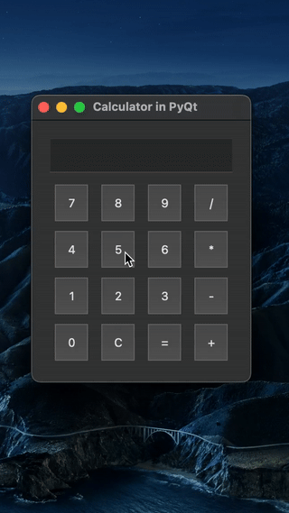

# 🧮 PyQt Calculator

A simple calculator built with Python and PyQt5. This app demonstrates the use of PyQt widgets like `QPushButton`, `QLineEdit`, and `QGridLayout` to build a functional GUI application.

## 📸 Demo




## 🚀 Features

- Responsive button-based input
- Basic arithmetic operations: `+`, `-`, `*`, `/`
- Input display with read-only safety
- Error handling for invalid expressions

## 🛠️ Tech Stack

- Python 3
- PyQt5

## 📦 Installation

### 1. Clone the repository
```bash
git clone https://github.com/yourusername/python_calculator.git
cd python_calculator
